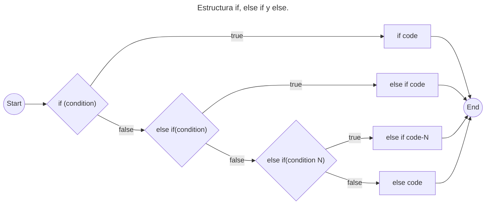
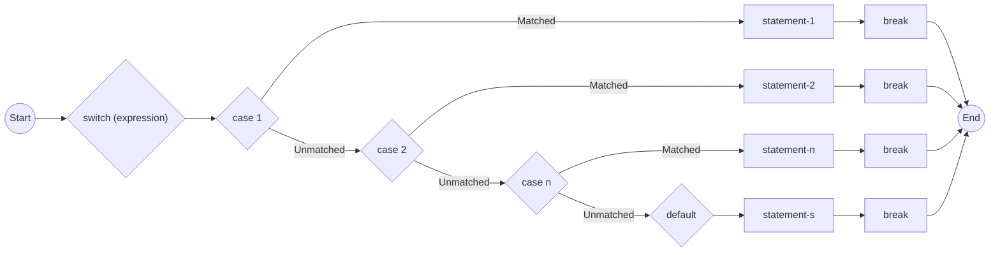

# Fundamentos

### Características

- Orientado a objetos.

- Multiplataforma.

- Rápido.

- Seguro.

- Versátil.

## Sintaxis Básica

Se basa en conceptos como clase, objeto, método, variable y estructuras de control de flujo.

**Identificadores**: se utilizan identificadores para nombrar variables, métodos y clases. Deben cumplir las siguientes reglas:

- Estar compuestas por letras en inglés (a-z, A-Z), números (0-9), guión bajo (\_) o dólar ($).

- Los números no pueden ser los primeros caracteres.

- La nomenclatura es:

  - Paquetes: minúsculas `package`.

  - Clases e interfaces: camelCase `ClassName`.

  - Variables y métodos: camelCase `variableMetodo`.

## Tipos de Datos y Variables

Una variable es un espacio donde se guarda un valor durante la ejecución del programa. A esta variable se le asigna un tipo de dato, el cual determina su valor. Deben ser declaradas antes de usarse.

### Declaración de una Variable

```java
// tipo nombre;
int cantidad;
// declaraciones validas
int a,b;
float pi;
double d;
char a;
```

### Inicialización de una Variable

```java
// para inicializar una variable se le debe asignar un valor
// nombre = valor;
cantidad = 55;
// ejemplos
// los decimales se indican con un punto '.'
pi = 3.14f; // los float deben tener una 'f' al final
d = 20.22d;
a = ´c´; // los char deben estar envueltos en '´''
```

Es posible declarar e inicializar una variable al mismo tiempo

```java
// tipo nombre = valor;
int a=2, b=3, c=4;
float pi = 3.14f;
char a = ´c´;
```

### Tipos de Variables

En Java, hay tres tipos:

1- Locales:

- Son declaradas dentro del cuerpo de un método.

2- De Instancia:

- Son declaradas fuera de un método, son especificas del objeto.

3- Estáticas:

- Se inicializan solo una vez. Deben inicializarse antes de cualquier variable de instancia.

```java
class Clase{
    static int a = 2; // variable estática
    int dato = 24; // variable de instancia
    void metodo(){
        int b = 87; // variable local
    }
}
```

### Tipos de Datos

#### Primitivos

Incluyen:

| Tipo      | Valor por Defecto | Tamaño  |
| --------- | ----------------- | ------- |
| `byte`    | 0                 | 1 byte  |
| `short`   | 0                 | 2 bytes |
| `int`     | 0                 | 4 bytes |
| `long`    | 0L                | 8 bytes |
| `float`   | 0.0f              | 4 bytes |
| `double`  | 0.0d              | 8 bytes |
| `boolean` | false             | 1 bit   |
| `char`    | ‘\u0000’          | 2 bytes |

##### Puntos a recordar:

- Todos los tipos numéricos tienen signo (+/-).

- El Tamaño de los tipos es el mismo en todas las plataformas.

- El tipo `char` es 2 bytes porque es un carácter **UNICODE**.

#### No Primitivos

Incluyen:

- `String`: cadenas de texto

- `Array`: arreglo de datos.

- `Class`: clases.

- `Interface`: interfaces.

### Conversiones

Una variable de un tipo puede recibir el valor de otro tipo.

1. La variable de menor capacidad se asigna a otra de mayor capacidad.

   ```java
   double d;
   int i = 8;
   d = i;
   ```

   El proceso es automático y no explícito. Este proceso es llamado **Conversión**.

2. La variable de mayor capacidad se asigna a otra de menor capacidad.

   ```java
   double d = 8;
   int i;
   i = (int)d;
   ```

   Se debe especificar explícitamente el **operador de conversión de tipos**. A este proceso se lo llama **Conversión de Tipos**.

   Si no se especifica el operador de conversión, el compilador arrojara un error.

_Ejemplo:_

```java
class Prueba{
    public static main(String[] args){
        byte x;
        int a = 270;
        double b = 128.128;
        System.out.println("int convertido a byte");
        x = (byte)a;
        System.out.println("a y x " + a + " " + x);
        System.out.println("double convertido a int");
        a = (int)b;
        System.out.println("b y a " + b + " " + a);
        System.out.println("\ndouble convertido a byte");
        x = (byte)b;
        System.out.println("b y x " + b + " " + x);
    }
}
```

_Salida:_

```
int convertido a byte
a y x 270 14
double convertido a int
b y a 128.128 128

double convertido a byte
b y x 128.128 -128
```

## Estructuras Condicionales

Es una porción de código la cual indica al algoritmo que acción ejecutar, dependiendo de una condición dada.

Consta de tres partes:

- **Condición**: se especifica la expresión que se evaluara, se usan operadores de comaparación entre vairables o valores. Pueden ser verdaders o falsas (`true` o `false`).
  - **Operadores de comparación**: `<`,`>`,`==`, `!=`, `<=`,`>=`.
- **Bloque verdadero**: es el código que se ejecuta si la condición fue `true`.
- **Bloque falso**: es el código que se ejecuta si la condición fue `false`.

> Los bloques de código se escriben entre corchetes `{}`.

### Estructura `if`

Se escribe `if (condición)`. Evalúa la condición entre paréntesis devolviendo un valor booleano. Si es `true` ejecutara el bloque de código, si es `false` lo omitirá y seguirá la ejecución.

```java
int edad = 17;
if (edad < 18){ // condicion
    // codigo a ejecutar
    System.out.println("Eres Menor de edad");
}
```

### Estructura `else if`

Comprueba una condición si el primer `if` no fue `true`. Se escribe `else if (condicion)`. Si es `true` ejecutara el bloque de código, si es `false` lo omitirá y seguirá la ejecución.

```java
String clima = "lluvioso";
if (clima == "soleado"){ // primera condicion
    // codigo a ejecutar
    System.out.println("Salir a pasear");
}
else if (clima  == "lluvioso"){ // segunda condicion
    // codigo a ejecutar
    System.out.println("Quedarse en casa");
}
else if (clima  == "nuboso"){ // tercera condicion
    // codigo a ejecutar
    System.out.println("Salir con precaucion");
}
```

A diferencia del `if` que se declara al inicio, `else if` puede estar declarado más de una ves.

### Estructura `else`

Si ninguna condición a sido verdadera entonces se ejecutara el código. se escribe solamente `else` seguido de la implementación del código.

```java
if (clima == "soleado"){ // primera condicion
    // codigo a ejecutar
    System.out.println("Salir a pasear");
}
else if (clima  == "lluvioso"){ // segunda condicion
    // codigo a ejecutar
    System.out.println("Quedarse en casa");
}
else if (clima  == "nuboso"){ // tercera condicion
    // codigo a ejecutar
    System.out.println("Salir con precaucion");
}
else {
    // codigo a ejecutar por defecto
    System.out.println("Tomar una siesta");
}
```

_Ejemplo:_

```java
class Main {
    static void main(String[] args){
        verTiempo("soleado");
        verTiempo("lluvioso");
        verTiempo("nuboso");
        verTiempo("estrellado");
    }
    public static void verTiempo(String clima){
        if (clima == "soleado"){ // primera condicion
            // codigo a ejecutar
            System.out.println("El clima esta soleado");
            System.out.println("Salir a pasear\n");
        }
        else if (clima  == "lluvioso"){ // segunda condicion
            // codigo a ejecutar
            System.out.println("El clima esta lluvioso");
            System.out.println("Quedarse en casa\n");
        }
        else if (clima  == "nuboso"){ // tercera condicion
            // codigo a ejecutar
            System.out.println("El clima esta nuboso");
            System.out.println("Salir con precaucion\n");
        }
        else {
            // codigo a ejecutar por defecto
            System.out.println("No hay registro");
            System.out.println("Tomar una siesta\n");
        }
    }
}
```

_Salida:_

```
El clima esta soleado
Salir a pasear

El clima esta lluvioso
Quedarse en casa

El clima esta nuboso
Salir con precaucion

No hay registro
Tomar una siesta
```



> Las variables de tipo `String` pueden usar el método `.equals()` para compararse.

### Estructura `switch`

Esta versión hace el código mas limpio y legible que el `if`, `else if` y `else`.

Evalúa una **expresión** o variable contra varios valores posibles, son expresados como `cases`, y ejecuta un bloque de código, el cual es finalizado por la palabra clave `break`.

_Ejemplo:_

```java
class Main{
    static void main(String[] args){
        int diaSemana = 12;
        switch (dia){
            case 1:
                System.out.printpl("Es lunes");
                break;
            case 2:
                System.out.printpl("Es martes");
                break;
            case 3:
                System.out.printpl("Es miercoles");
                break;
            case 4:
                System.out.printpl("Es jueves");
                break;
            case 5:
                System.out.printpl("Es viernes");
                break;
            case 6:
                System.out.printpl("Es sabado");
                break;
            case 7:
                System.out.printpl("Es domingo");
                break;
            default:
                System.out.printpl("¿Que dia es hoy?");
                break;
        }
    }
}
```

_Salida:_

```
¿Que dia es hoy?
```



> Se prueba cada caso hasta que se devuelve `true`.
>
> En el caso de que ninguno devuelva `true`, se ejecutara el bloque `default`.

## Funciones

Una funcion o método, es un bloque de código, colección de declaraciones, que realiza una determinada operación. Permite la reutilizacion de código, ya que una vez escrito puede usarse varias veces.

> El más importante en Java es el método **main()**.

### Declaración

Proporciona informacion sobre los atributos del método, como visibilidad, tipo de retorno, nombre y argumentos.

```java
// acceso tipo nombre (argumentos)
public int suma (int a, int b){ // encabezado
    // cuerpo del metodo
}
```

**Accesso**: especifica la visibilidad del metodo:

- `public`: indica que el método es accesible por todas las clases.
- `private`: el método solo es accesible en la clase que se define.
- `protected`: es accesible dentro de la misma clase y subclases.
- `default`: si no se usa un especificador de acceso el predeterminado es `private`.

**Tipo de Retorno**:es el tipo de dato que devuelve el método. Puede ser primitivo, objeto, colección, vacio, etc. Si no devuelve nada se utiliza la palabra clave `void`.

**Nombre**: es unico el cual defina la función del método.

**Parametros**: encerrados con parentecis `()`, es una lista separada por comas, donde se declaran variables, con su tipo y nombre. Si el método no tiene parametros, los parentecis quedan en vacios.

**Cuerpo**: contiene todas la acciones que se van a realizar. Está encerrado entre corchetes `{}`.

### Nomenclatura

El nombre de ser un **verbo** y empezar con minúscula. Si son más de dos palabras, el verbo debe ser deguido de un adjetivo o sustantivo. Se utiliza camelCase, cada palabra empieza con mayúscula, siendo la primera minúscula.

> Es posible que un método tenga el mismo nombre que otro en la misma clase, se conoce como **método de sobrecarga**.

```java
public int sumar(int a, int b){...}
public void organizarNumeros(int[] numeros){...}
```

### Tipos de Metodo

Existen dos tipos de métodos en Java: los predefinidos, y los definidos por el usuario.

**Mètodos Predefinidos**

Son métodos que ya estan definidos en Java, pueden ser llamados en cualquier momento en el programa.

_Ejemplo:_

```java
public class Prueba{
    public static void main(String[] args){
        // Utilizacion del método max() de la clase Math
        System.out.println("El numero mayor es: " + Math.max(15,9));
    }
}
```

_Salida:_

```
El numero mayor es: 15
```

> Métodos como `main()`, `println()` y `max()`, ya se encuentran predefinidos. `max()` pertenece a la clase `Math`, `println()` a `PrintStream`.

**Métodos Definidos por el Usuario**

Son aquellos que son escritos por el programador, estos se modifican según el requerimiento. Son invocados mediante su nombre y argumentos.

_Ejemplo:_

```java
import java.util.Scanner;

public class Main{
    public static void main(String[] args){
        // se crea un objeto de la clase Scanner
        Scanner scan = new Scanner(System.in);
        System.out.print("Ingrese un numero: ");
        // el usuario ingresa un valor
        int num = scan.nextInt();

        // invocamos el metodo esPar()
        if (esPar(num)){
            System.out.println("El numero " + num + " es Par");
        } else {
            System.out.println("El numero " + num + " es Impar");
        }
    }
    // método definido por el usuario
    public static boolean esPar(int numero){
        // cuerpo del método
        if (numero % 2 == 0){
            return true;
        } else {
            return false;
        }
    }
}
```

_Salida:_

```
Ingrese un numer: 25
El numero 25 es Impar
```

### Métodos Estaticos

Poseen la palabra clave `static`. Indica que el método pertence a la clase y no a una instancia de la clase, pueden ser llamados sin crear un objeto, puden ser invocados a traves del nombre de la clase.

_Ejemplo:_

```java
public class Prueba{
    public static void main(String[] args){
        saludar();
    }
    static void saludar(){
        System.out.println("Bienvenido...");
    }
}
```

_Salida:_
´´´
Bienvenido...
´´´

### Método de Instancia

No son estaticos y son definidos en la clase para ser utilizados al crear objetos de la clase.

_Ejemplo:_

```java
public class Prueba{
    public static void main(String[] args){
        Prueba obj = new Prueba();
        int a = 25;
        int b = 10;
        System.out.println("El producto de " + a + " y " + b + " es: " + multiplicar(a,b));
    }
    public int multiplicar(int a, int b){
        return a * b;
    }
}
```

_Salida:_

```
El producto de 25 y 10 es: 250
```

Hay dos tipos de métodos de instancia:

- **Métodos de Acceso**: permiten leer variables de instancia de un objeto. Se identifican facilmente con el prefijo **get**, llamados **getters**. Devuelven un valor que es privado.

  ```java
  public int getId(){
      return id;
  }
  ```

- **Métodos Mutadores**: son quienes pueden modificar las variables de instancia de un objeto. Se identifican facilmente con el prefijo **set**, llamados **setters**. No devuelven ningún valor, y tienen como parametro el mismo tipo de dato que la variable a la que hacen referencia.

  ```java
  public void setEdad(int edad){
      this.edad = edad;
  }
  ```

_Ejemplo:_

```java
public class Alumno{
    private int edad;
    private String nombre;
    public void setEdad(int edad){
        this.edad = edad;
    }
    public int getEdad(){
        return edad;
    }
    public void setNombre(int nombre){
        this.nombre = nombre;
    }
    public String getNombre(){
        return nombre;
    }
    public void verAlumno(){
        System.out.println("Alumno: " nombre);
        System.out.println("Edad: " edad);
    }
}
```

### Métodos Abstractos

Estos métodos no poseen cuerpo, no tienen implementación. Son declarados en **clases Abstractas**. Se utiliza la palabra clave `abstract` para crearlas.

```java
abstract void metodo();
```

### Funciones Lambda

Son funciones anónimas, las cuales pueden ser pasadas como argumentos o utilizarlas en colecciones.

1- **Declaracion**: su sintaxis es `() -> { código }`, donde `()` indican los parametros de entrada, y `{ código }` es el bloque de código que se ejecutara.

```java
// funcion lambda que devuelve el cuadrado de un numero
Integer cuadrado = (int x) -> x * x;
```

2- **Utilización en colecciones**: se utilizan comunmente en colecciones para deficinir que acciones se aplicarán a los elementos de esta.

```java
// ejemplo para filtrar numeros pares de una lista y los ordena de menor a mayor
List<Integer> numeros = Arrays.asList(2,35,69,26,11,90);
List<Integer> res = numeros.stream()
            .filter(x -> x % 2 == 0)
            .sorted();
// ahora los mostramos en la consola
res.stream().forEach(System.out::println);
```

_Salida:_

```
2
26
90
```

3- **Utilizadas como argumentos**: tambien pueden ser utilizacas como argumentos:

```java
List<Persona> personas = creacionDeLista();
Collections.sort(personas, (p1, p2) -> p1.getNombre().compareTo(p2.getNombre()));
```

## Fecha y Tiempo

## Bucles

## Manejo de Excepciones

## Estructuras de Datos

## POO, Interfaces y Clases

## Paquetes

## Archivos y APIs
